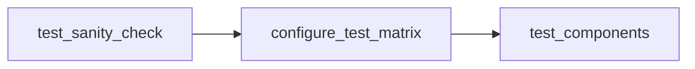

# Adding tests to TheRock

## Test Flow

After TheRock builds its artifacts, we test those artifacts through [`test_artifacts.yml`](../../.github/workflows/test_artifacts.yml). The testing flow works as:



where we:

1. Check that the artifacts pass sanity tests.
1. The `configure_test_matrix` step runs [`fetch_test_configurations.py`](../../build_tools/github_actions/fetch_test_configurations.py), where we generate a test matrix for which tests to run.
1. After we generate the matrix, `test_components` executes those tests in parallel.

### How these tests are executed

These tests are retrieved from [`fetch_test_configurations.py`](../../build_tools/github_actions/fetch_test_configurations.py), where we generate a matrix of tests to run for various AMD GPU families from [`amdgpu_family_matrix.py`](../../build_tools/github_actions/amdgpu_family_matrix.py) on both Linux and Windows test machines.

These tests are run per pull request, main branch commit, `workflow_dispatch` and nightly runs.

### What kind of tests are suitable for TheRock

Since TheRock is the open source build system for HIP and ROCm, we are interested in tests for individual subprojects as well as tests that exercise multiple subprojects, especially for build and runtime dependencies. We also perform higher level testing of overall user-facing behavior and downstream frameworks like PyTorch.

## Adding tests

To add tests, add your executable logic to `github_actions/test_executable_scripts` with a Python file (in order to be compatible with Linux and Windows). Below is an example for [`hipblaslt.py`](../../build_tools/github_actions/test_executable_scripts/test_hipblaslt.py):

```python
cmd = [f"{THEROCK_BIN_DIR}/hipblaslt-test", "--gtest_filter=*pre_checkin*"]
logging.info(f"++ Exec [{THEROCK_DIR}]$ {shlex.join(cmd)}")
subprocess.run(
    cmd,
    cwd=THEROCK_DIR,
    check=True,
)
```

After creating your script, please refer below to create your test entry in [`fetch_test_configurations.py`](../../build_tools/github_actions/fetch_test_configurations.py)

## Fields for the test matrix

Add an entry in [`test_matrix`](../../build_tools/github_actions/fetch_test_configurations.py), then your test will be enabled in the test workflow

In [`fetch_test_configurations.py`](../../build_tools/github_actions/fetch_test_configurations.py), a test option (in this example rocBLAS) in `test_matrix` is setup as:

```
"rocblas": {
    "job_name": "rocblas",
    "fetch_artifact_args": "--blas --tests",
    "timeout_minutes": 5,
    "test_script": f"python {SCRIPT_DIR / 'test_rocblas.py'}",
    "platform": ["linux", "windows"],
}
```

| Field Name          | Type   | Platform | Description                                                                                                                        |
| ------------------- | ------ | -------- | ---------------------------------------------------------------------------------------------------------------------------------- |
| job_name            | string | Any      | Name of the job                                                                                                                    |
| fetch_artifact_args | string | Any      | Arguments for which artifacts for [`install_rocm_from_artifacts.py`](../../build_tools/install_rocm_from_artifacts.py) to retrieve |
| timeout_minutes     | int    | Any      | The timeout (in minutes) for the test step                                                                                         |
| test_script         | string | Any      | The path to the test script                                                                                                        |
| platform            | array  | Any      | An array of platforms that the test can execute on, options are `linux` and `windows`                                              |
| container_image     | string | Linux    | The name of a container image to use for this component                                                                            |
| container_options   | string | Linux    | Additional options to be passed when launching the container                                                                       |
| emulate             | string | Linux    | Emulator backend to also run this component under, e.g. `"rocjitsu"`. See [Emulated tests](#emulated-tests-mirage--rocjitsu)       |
| emulate_only        | bool   | Linux    | Only run the emulated variant; do not run this component on hardware                                                               |
| emulate_test_type   | string | Linux    | Test category the emulated variant is pinned to, regardless of the run's `TEST_TYPE`                                               |

> [!NOTE]
> When adding a new component to TheRock (typically a new .toml file), you may need to update `install_rocm_from_artifacts.py` to allow CI workflows and users to selectively install it.<br>
> Adding libraries to existing components requires no script changes.<br>
> See the [Adding Support for New Components](./installing_artifacts.md#adding-support-for-new-components) guide for step-by-step instructions.

## Emulated tests (mirage / rocjitsu)

Some GPU targets have no test hardware in CI, and some failures are cheaper to
catch against a simulated device than a real one. For those,
[`fetch_test_configurations.py`](../../build_tools/github_actions/fetch_test_configurations.py)
can derive an **emulated variant** of a test component that runs on the CPU
cluster, with [mirage](https://github.com/ROCm/rocm-systems/tree/develop/emulation/mirage) driving the
[rocjitsu](https://github.com/ROCm/rocm-systems/tree/develop/emulation/rocjitsu) software GPU emulator instead
of talking to a real device.

Opting a component in is a single field:

```
"rocrtst": {
    "job_name": "rocrtst",
    ...
    "emulate": "rocjitsu",
}
```

That produces a second matrix entry alongside the hardware one, named
`rocrtst (emulated mi350x)`, which:

- runs on the CPU cluster (`linux_cpu_runner`), with no GPU devices mapped into
  the container — rocjitsu emulates the GPU in software, so an emulated job on
  GPU hardware would hold a scarce runner for its whole timeout and use none
  of it,
- additionally fetches the `mirage` and `rocjitsu` artifacts,
- gets 10x the component's `timeout_minutes`, capped at one hour — the budget
  an emulated component has to fit in to be worth scheduling at all, and so the
  right point to stop waiting on a wedged emulator. There is deliberately no
  floor at the hardware budget: the emulated variant runs a cheaper category,
  so a component that hits the cap needs an `emulate_test_type`, not a longer
  leash,
- runs unsharded, and
- has its whole `test_script` wrapped in `mirage run`, with `TEST_EMULATOR` and
  `TEST_EMULATOR_PROFILE` baked in as literals — so the command reproduces a
  run on its own, including under the component-repo copies of
  `test_component.yml` and in the failure-reproduction output.

The `test_script` itself is unchanged, which is the point: the emulated variant
runs the same entry point the hardware job does, so emulation does not fork the
test definition. For components on the standardized
[`test_runner.py`](../../build_tools/github_actions/test_executable_scripts/test_runner.py)
that means the emulated job selects from the same component-owned
`test_categories.yaml` — usually a cheaper category than the hardware job runs
(see [Choosing what an emulated job runs](#choosing-what-an-emulated-job-runs)),
but through the same mechanism.

Everything that excludes the hardware job — `exclude_family`, test labels,
project selection — excludes the emulated variant too. The one exception is the
multi-GPU availability check: rocjitsu emulates the device in software, so a
component whose family has no multi-GPU pool still gets its emulated variant.

> [!IMPORTANT]
> Emulated jobs must never be routed to GPU hardware — they would hold a scarce
> runner for their whole timeout and use none of it. `test_artifacts.yml` routes
> them with `linux_cpu_runner`, but that clause is **4th of 5** in the
> `test_runs_on` chain: `multi_gpu_runner` → the `workflow_dispatch`
> `test_runs_on` override → `is_benchmark` → `linux_cpu_runner` → the
> per-component runner. So the emulated variant must drop *every* key checked
> ahead of it — `_build_emulated_job` pops `multi_gpu`, `multi_gpu_runner`, and
> `is_benchmark`. Anything added ahead of `linux_cpu_runner` in that chain must
> be popped there too. A `workflow_dispatch` run that sets `test_runs_on`
> explicitly still overrides this, as it does for every other CPU-only
> component.

> [!WARNING]
> The component repositories keep their own copies of this routing chain and of
> `test_component.yml` (`therock-test-packages.yml` / `therock-test-component.yml`
> in `rocm-systems`, `rocm-libraries`, and `rocgdb`), and they run *TheRock's*
> `fetch_test_configurations.py` from a pinned ref. Those copies do **not** yet
> carry the emulation changes, so before bumping that pin each one needs:
>
> - `TEST_COMPONENT: ${{ fromJSON(inputs.component).test_component || fromJSON(inputs.component).job_name }}`
>   — otherwise `TEST_COMPONENT` becomes the decorated job name
>   (`rocrtst (emulated mi350x)`) and `test_runner.py` resolves a test directory
>   that does not exist,
> - `if: ${{ !fromJSON(inputs.component).linux_cpu_runner }}` on the
>   "Driver / GPU sanity check" step,
> - `linux_cpu_runner` checked **before** any family-specific `test_runs_on`
>   override. `rocm-systems` currently puts a `gfx125X` override first, which
>   would route mi450x emulated jobs onto the scarce MI455 GPU runners.
>
> `rocrtst` — the one emulated component today — lives in `rocm-systems`.

### Which families are emulated

`_MIRAGE_PROFILE_BY_FAMILY_PREFIX` maps an AMDGPU family to one of mirage's
builtin profiles (see
[`profiles.rs`](https://github.com/ROCm/rocm-systems/blob/develop/emulation/mirage/builtin/src/profiles.rs)),
and `_EMULATED_PROFILES` selects which of those CI actually schedules jobs for:

| Family          | mirage profile | Emulated GPU     | Scheduled in CI                      |
| --------------- | -------------- | ---------------- | ------------------------------------ |
| `gfx94X-dcgpu`  | `mi300x`       | MI300X (gfx942)  | No — ample hardware                  |
| `gfx950-dcgpu`  | `mi350x`       | MI350X (gfx950)  | Yes                                  |
| `gfx125X-dcgpu` | `mi450x`       | MI450X (gfx1250) | Yes, once the family has a test lane |

> [!NOTE]
> `gfx125X-dcgpu` currently sets `test-runs-on: ""` in
> [`amdgpu_family_matrix.py`](../../build_tools/github_actions/amdgpu_family_matrix.py),
> and `test_artifacts.yml` skips the whole test lane for a family without a test
> runner. The emulated entries are generated correctly for it, but nothing
> schedules them until that family is given a runner.

### Writing an emulated test script

The generator wraps the whole `test_script` in a mirage session, so the script
is already running against the emulated GPU when it starts:

```
$THEROCK_BIN_DIR/mirage run --profile mi350x --emulator rocjitsu \
  --env TEST_EMULATOR=rocjitsu --env TEST_EMULATOR_PROFILE=mi350x \
  --env THEROCK_BIN_DIR=$THEROCK_BIN_DIR ... \
  -- python .../test_runner.py
```

Everything the script does — compiling, launching test binaries, spawning ctest
or pytest — happens inside that one session, and the script never invokes mirage
itself. *Which* tests run is decided by the matrix entry's `emulate_test_type`,
not by the script; `emulation.is_emulated()` exists for the few scripts that
have to behave differently under an emulator (`test_emulation_smoke.py` refuses
to run outside one, and `test_runner.py` uses it to turn an empty ctest
selection into a hard failure).

> [!NOTE]
> `mirage host` starts the workload with `env_clear()`, re-inheriting only
> `PATH`/`HOME`/`USER`/`LANG`/`LC_ALL`/`TERM`/`TMPDIR`. Everything else —
> `THEROCK_BIN_DIR`, `TEST_TYPE`, `AMDGPU_FAMILIES`, the shard variables, the
> `OMP_NUM_THREADS`/`OPENBLAS_NUM_THREADS` limits derived from the pod's
> `KUBE_CPU_REQUEST` — has to cross the session boundary by name, which is what
> the `--env` list is for. Each is emitted as `${NAME:+--env NAME=$NAME}` so a
> variable the workflow left unset stays unset inside the session rather than
> becoming an empty string. A script that starts reading a new CI variable must
> add it to `_EMULATION_FORWARDED_ENV` in `fetch_test_configurations.py`, or it
> will be unset under emulation.
> `test_forwarded_env_covers_what_the_scripts_read` reads the emulated entry
> points and fails when one of them reads a variable that is neither forwarded
> nor listed as deliberately local. It only sees direct `os.getenv` /
> `os.environ` reads in those entry points — env consumed by a helper module,
> or by a binary ctest launches (the sanitizer variables, for instance), is not
> covered.

Anything an emulated script can derive, it should derive rather than expect to
be forwarded — `test_runner.py` derives `ROCM_PATH` from `THEROCK_BIN_DIR` for
exactly this reason, which guarantees it points at the artifacts this job
actually fetched.

Scripts that need to behave differently under an emulator can ask, using
[`emulation.py`](../../build_tools/github_actions/test_executable_scripts/emulation.py):

```python
import emulation

if emulation.is_emulated():
    ...  # already inside the mirage session; nothing to launch
```

The two emulated components today are:

| Component         | Script                    | What it does                                                            |
| ----------------- | ------------------------- | ----------------------------------------------------------------------- |
| `emulation-smoke` | `test_emulation_smoke.py` | Runs `rocminfo` under mirage and checks the emulated agent's identity   |
| `rocrtst`         | `test_runner.py`          | Runs a rocrtst `test_categories.yaml` category against the emulated GPU |

### Choosing what an emulated job runs

Emulation is orders of magnitude slower than hardware and does not implement
everything, so an emulated variant is expected to run a different, cheaper set
of tests than the hardware one — the scaled timeout is headroom, not a licence
to run the full suite.

**That set belongs to the component, in its `test_categories.yaml`.** TheRock
only names the category, and the name to use is the existing ROCm-wide
simulator tier — `ffm-quick`, which rocwmma, rocthrust, hipcub, rocprim and
rocfft already declare:

```
"emulate_test_type": "ffm-quick",
```

This is a **pin, not a default**: which categories an emulator can get through
is a property of the emulator, so a nightly run asking for `comprehensive` must
not drag the emulated variant along with it. Components that leave it unset
follow the run's `TEST_TYPE`. Prefer one of the `ffm-*` tiers already in
`VALID_TEST_CATEGORIES` in
[`test_runner.py`](../../build_tools/github_actions/test_executable_scripts/test_runner.py);
if a genuinely new name is unavoidable it has to be added there too, since an
unlisted value silently falls back to `quick`.

### Declaring an emulation category (component side)

rocrtst's `test_categories.yaml` in `rocm-systems` is the worked example. An
emulation category is an ordinary category plus `env_variables`:

```yaml
  ffm-quick:
    description: "Emulated GPU (rocjitsu, driven by mirage) - hardware-free CI"
    test_patterns:
      - "rocrtst.Test_Example"
      # ... the tests that survive the emulator
    exclude:
      - "rocrtstFunc.Memory_Max_Mem"
    env_variables:
      - "ROCRTST_PLATFORM_OVERRIDE=EMULATOR"
    labels:
      - "ffm-quick"
      - "emulation"
```

`parse_test_categories.py` compiles `env_variables` into the CTest entry's
`ENVIRONMENT` property, so it reaches the test binary for anyone running
`ctest`, not just CI. That is why emulator environment belongs here rather than
in the mirage wrapper: the wrapper would apply it to the whole session
(including the runner process) and would not reproduce outside CI.

Two things to remember when adding one:

- Give the category its own `execution_settings.category_timeouts` entry. CTest
  bakes `TIMEOUT` into the installed `CTestTestfile.cmake` and `ctest --timeout`
  does **not** raise it, so a category whose emulated run exceeds its own budget
  fails regardless of what the job timeout says.
- Add the category name to every applicable `exclude_gpu_*` `labels` list. A
  category missing from one gets no `<category>_<gfx>` entry, and
  `test_runner.py` — which selects `-L ^<category>$ -L ^ex_gpu_<arch>$` whenever
  the component has any GPU-specific entries — would then match no tests at all.

### Skipping tests an emulator cannot run

Prefer letting the component decide, and say it in `test_categories.yaml`.
rocrtst's `ffm-quick` tier is `standard` minus the three tests that fail
under rocjitsu (unimplemented dmabuf interop, an SVM attribute query, and FP
exception delivery), and its `ROCRTST_PLATFORM_OVERRIDE=EMULATOR` makes rocrtst
skip the ~50 further entries under `platforms.EMULATOR.blocked_tests` in
`share/rocrtst/platform_config.yaml` and shrink its allocation sizes and
iteration counts.

Keeping that list with the component means one place to update when the
emulator grows a capability, and it keeps `fetch_test_configurations.py` from
re-growing the per-component test filters that the move to `test_runner.py`
exists to retire.
